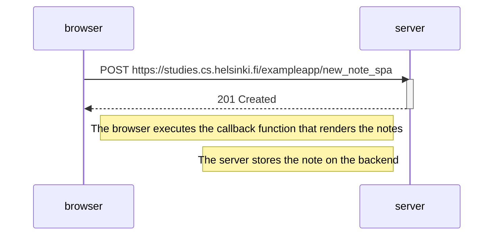

```mermaid

sequenceDiagram 
browser->>server: POST https://studies.cs.helsinki.fi/exampleapp/new_note_spa
activate server
server-->>browser: 201 Created
deactivate server
Note right of browser: The browser executes the callback function that renders the notes
Note left of server: The server stores the note on the backend

```