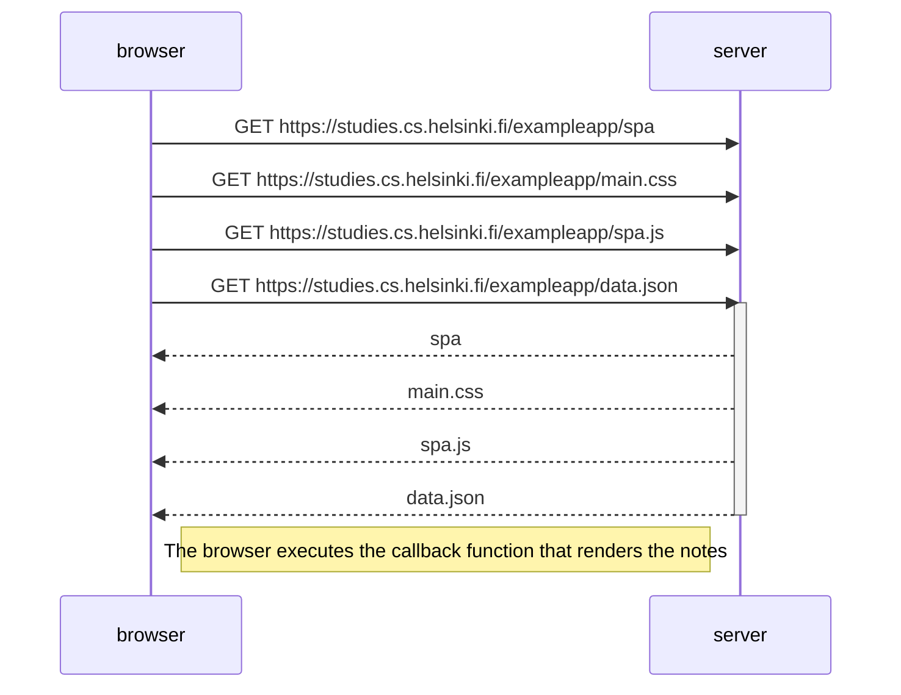

```mermaid

sequenceDiagram 
browser->>server: GET https://studies.cs.helsinki.fi/exampleapp/spa
browser->>server: GET https://studies.cs.helsinki.fi/exampleapp/main.css
browser->>server: GET https://studies.cs.helsinki.fi/exampleapp/spa.js
browser->>server: GET https://studies.cs.helsinki.fi/exampleapp/data.json
activate server
server-->>browser: spa
server-->>browser: main.css
server-->>browser: spa.js
server-->>browser: data.json
deactivate server

Note right of browser: The browser executes the callback function that renders the notes
```
